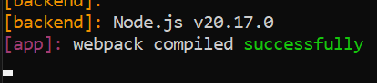
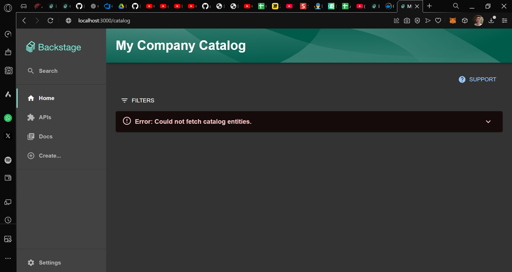
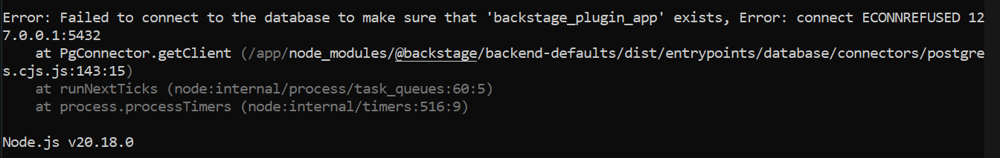
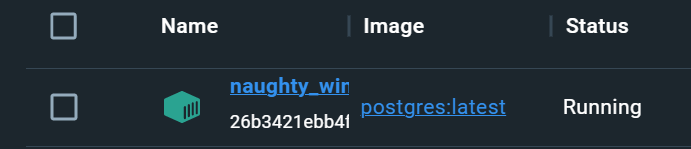

# Backstage com Docker

### Introdução

O Backstage é uma plataforma de código aberto criada pelo Spotify para gerenciar serviços, microsserviços e dados de infraestrutura. O objetivo desta atividade é construir e rodar uma instância do Backstage utilizando o Docker.

### Pré-requisitos

Para iniciar o setup, é necessário ter instalados Docker e Node (v20).

## Instalação e execução

Primeiramente, é necessário criar um app Backstage:

```cmd
npx @backstage/create-app@latest
```

Depois da intalação, já é possível executar o Backstage localmente:

```cmd
cd backstage # nome da pasta
yarn dev
```


Imagem 1: Execução no terminal


Imagem 2: Execução web (é possível notar que nenhuma entidade está sendo encontrada, pois não foi configurado)

**Após isso, é possível iniciar a o setup do Docker**

Na pasta do Backstage, execute:
```cmd
yarn install --immutable

yarn tsc

yarn build:backend --config ../../app-config.yaml --config ../../app-config.production.yaml
```

Após a configuração do projeto, é possível criar a imagem do Docker:

```cmd
yarn build:backend --config ../../app-config.yaml --config ../../app-config.production.yaml
```

E depois criar o container:

```cmd
docker run -it -p 7007:7007 backstage
```

## Conclusão (temporária)


Imagem 3: Erro na execução do container Backstage

Após isso não consegui resolver o erro, tentei diversas soluções, como instalar o plugin "backstage_plugin_app", criar um container para o postgres, mas nada resolveu... 


Imagem 4: Container Postgres em execução
